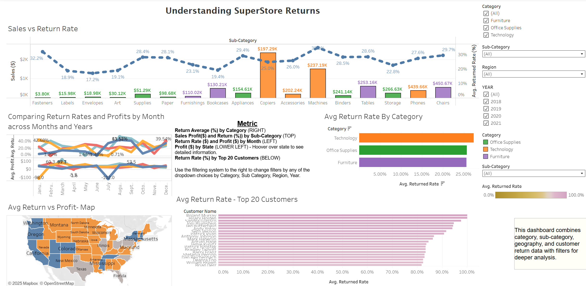

# 📊 Data Projects — TripleTen Portfolio

This repository contains projects I’ve completed during the **TripleTen Business Intelligence Analyst bootcamp**.  
Each project demonstrates skills in SQL, Tableau, Power BI, and data storytelling.

---

## 🚀 Projects

### Sprint 5 — Superstore Returns (Tableau)
- 📘 [Project Details](./Sprint5-Superstore-Returns-Tableau/README.md)  
- 🌐 [Tableau Dashboard](https://public.tableau.com/views/Sprint5tableauvisuals/SuperstoreReturnsPresentation?:language=en-US&publish=yes&:sid=&:redirect=auth&:display_count=n&:origin=viz_share_link)  

**Preview:**  

---

### Sprint 6 — App Landscape (Power BI)
- 📘 [Project Details](./Sprint6-App-Landscape-PowerBI/README.md)  
- 📑 [Power BI PDF Export](./Sprint6-App-Landscape-PowerBI/Sprint6pdf.pdf)  

**Preview:**  

