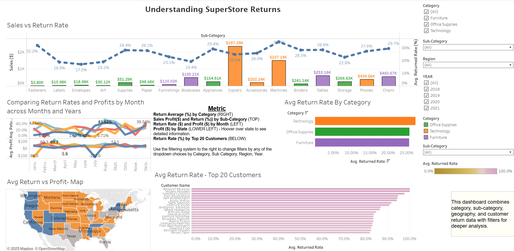

# 📊 Superstore Returns Analysis (Sprint 5 — Tableau)

## Overview
This project analyzes **returns in a retail Superstore dataset**. It was completed as part of the **TripleTen Business Intelligence Analyst bootcamp (Sprint 5: Storytelling with Data)**.

[🔗 View the Tableau Dashboard](https://public.tableau.com/views/Sprint5tableauvisuals/SuperstoreReturnsPresentation?:language=en-US&publish=yes&:sid=&:redirect=auth&:display_count=n&:origin=viz_share_link)

---

## 👀 Dashboard Preview

---

## 📂 Project Description
- Return rates across categories, segments, and regions  
- Key drivers contributing to high return rates  
- Profitability impact of returned items  
- Insights & recommendations for reducing return volume

---

## 🛠 Tools & Skills Applied
- Tableau – dashboard design & storytelling  
- Data analysis – trends, drivers, profitability  
- Business intelligence – turning raw data into insights
- 
## 📌 Files in This Folder  

- 🖼️ [Dashboard Preview](Dashboard-screenshot1.png)  
- 📄 [Full Project Write-up (README)](README.md)  
