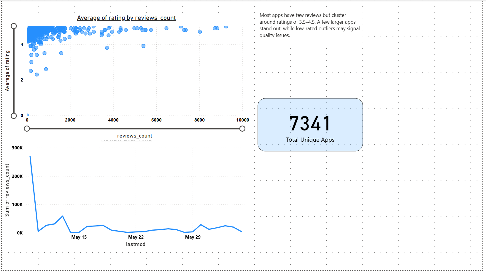

# 📊 App Landscape Analysis (Sprint 6 — Power BI)

## Overview  
This project was completed as part of the **TripleTen Business Intelligence Analyst bootcamp (Sprint 6: App Landscape)**.  
The goal was to analyze **app reviews and developer performance** using **Power BI**, uncovering insights about ratings, helpfulness, and responsiveness.  

---

## 👀 Dashboard Preview  

Preview:  

---

## 📂 Project Description  
- App ratings & reviews distribution  
- Average helpful reviews by developer  
- Developer responsiveness and its correlation with ratings  
- Competitive landscape (top developers by review volume)  

---

## 🛠 Tools & Skills Applied  
- Power BI – dashboards, KPI cards, DAX measures  
- Data modeling – relationships & calculated measures  
- Business intelligence – insights from review data  

---

## 📌 Files in This Folder

- [Dashboard Preview](Sprint6-screenshot.png) → Dashboard preview  
- [Full Report Export (PDF)](Dashboard-pdf1.pdf) → Full report export (Power BI PDF)  
- [Raw Power BI File (PBIX)](Sprint6.pbix) → Optional raw Power BI file  
- [Project Documentation (README)](README.md) → This file

---

✨ **Next Steps:** Expand this analysis with **trend forecasting, cohort comparisons, and deeper DAX-driven insights** in future sprints.  
